# A metered prism for the Bronica S2 that doesn't suck:  Guide to adapt a Kiev 88 TTL (free/opensource cad file, printable template)

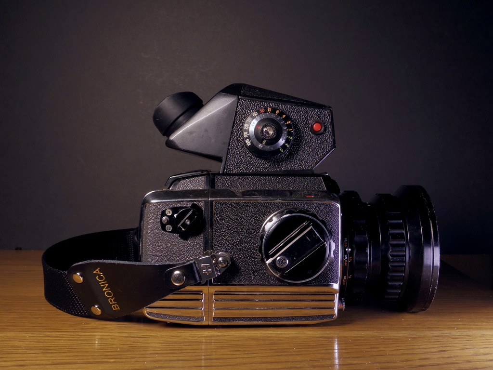
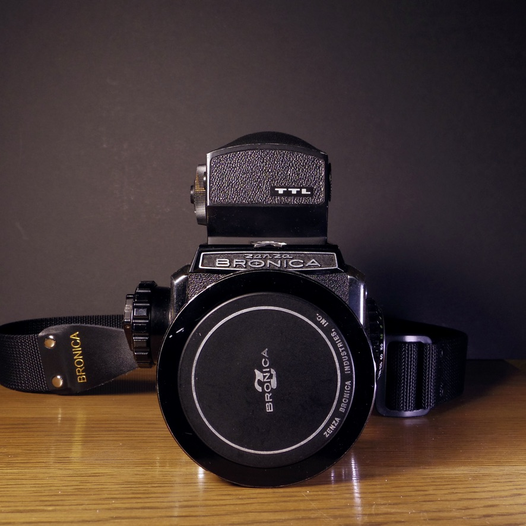
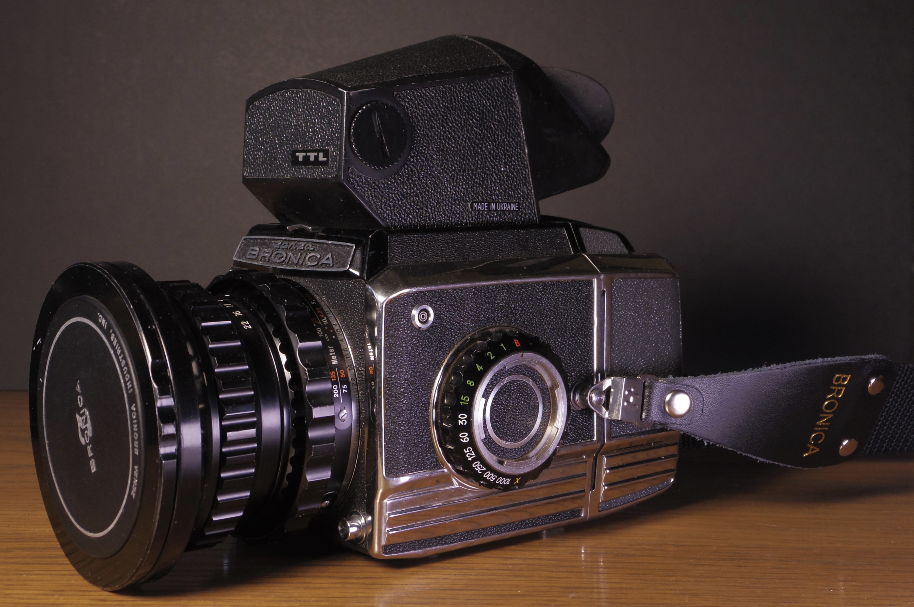

There are occasions where it would be nice to have a prism, and a some when it would be nice to have a built-in meter (particularly for macro/bellows and for shooting adapted lenses where I may be unsure of the actual fstop).

Of course Bronica made prisms for the S2 series:  the 90 degree Prism A and the 45 degree Prism C.  I briefly bought and quickly sold each.  Neither is metered.  Although the angle of the C feels more natural and it's smaller than the Prism A, the view is VERY dim, somewhat restricted, and not pleasant at all. The A prism is only marginally better in terms of view, but its looks, weight, and size resemble nothing more than a fucking boat.  

There is a metered chimney finder for the S2a system, and it looks like a 60s Cadillac Deville that got stuck on the top of the camera. It actually makes the Boat Prism C look good by comparison.  While I have one, the cable on mine that connects the finder to the shutter dial attachment is broken, so saving that for another time.  (If you know btw, what that two-pin screw-lock connector type is called, let me know.  It's not an 8mm aircraft connector, though it looks *very* similar).  

Researching other options, I found [this old flickr thread](https://www.flickr.com/groups/2677388@N24/discuss/72157658792446389/), which led me to [this photo.net thread](https://www.photo.net/forums/topic/10137-has-anyone-used-kiev-spot-ttl-prism-on-bronica-s2a/) about adapting Kiev 88 prisms to the Bronica S series.  

I decided to go for the regular metered version of the Kiev prism (TTL), but there are a few other Kiev 88 prisms that share the same footprint and should work with this as well (including the Spot-TTL).  While I wouldn't describe the Kiev 88 prism as compact or particularly good looking, it's far lighter and way better looking than either of the Bronica prisms.  And much brighter and clearer too.  I should probably mention that none of the meters in these prisms couple to the camera - you have to make sure the settings on the meter mirror those set on the body (and the iso of your film).

*Note:  the EC series uses an entirely different mechanism to attach finders/prism, so this will not work for those cameras.  (But if anyone feels like giving me another Kiev prism on the cheap, I think it's doable.)*

## How to do the adaptation

There are three things you'll need to do to make the Kiev work securely on the Bronica S2a.  

1)  You need to replace the base plate to match the correct Bronica dimensions, and add holes for the two Bronica finder alignment pins.

2)  You need to file two grooves in the back bottom of the Kiev 88 prism.  Two prongs from the back side of the camera slide into these grooves, above the base plate, holding down the back end of the finder.  

3)  You need to grind or file a small notch in the front side of the finder.   The front release catch of the Bronica fits into this groove, locking it into place.  Ideally the cross-section of the groove should be triangular, with a bottom parallel to the ground glass and a 45 degree angle upward cut.  Careful not to go too deep (I did!).  

As long as you keep the original Kiev plate and can reattach it, none of these steps render the prism unable to work with the Kiev the way it was intended.

### problem #1 the base plate

I created an openscad file for a 2d template that has the correct dimensions for the Bronica, the finder alignment pin holes for the Bronica, and the screw holes from the native Kiev base plate. 

Actually, before doing that, I made [3 failed prototypes](https://imgur.com/a/NDPlpRM) by hand out of brass, trying to copy the hole pattern, but failing to get it accurate enough for all the screws to go in.  But never mind that part.

After printing out over 14 versions of the baseplate template to make sure the hole alignment matched the native baseplates near perfectly, I sent it to be laser cut from **0.04" brass** via Sendcutsend (my first time ever having something laser cut like this).  The plate cost less than $10, but thus fell below the threshold for free shipping, so the total was closer to $30.  Not that bad.

The plate arrived.  I sanded the rough edges. Then I GENTLY gave each of the holes for Kiev screws a slight countersink with a 3mm drill bit and a hobby hand-powered crank drill - just enough so the screw heads sit flat, but not enough to let the screw heads go through the thin brass.

I screwed back in the 8 screws and it was a perfect fit.  Measure once, cut thrice, get smart, measure 14 times, and cut once more, my grandpa used to say.

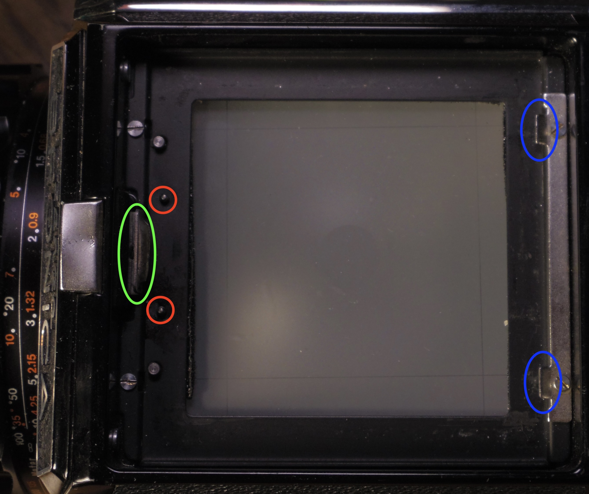
*looking down into the body with no finder installed.  In red are the finder alignment pins;  in green, the latch that holds down the front;  in blue the two prongs that slide over the plate into the notches to hold down the back side.*
   

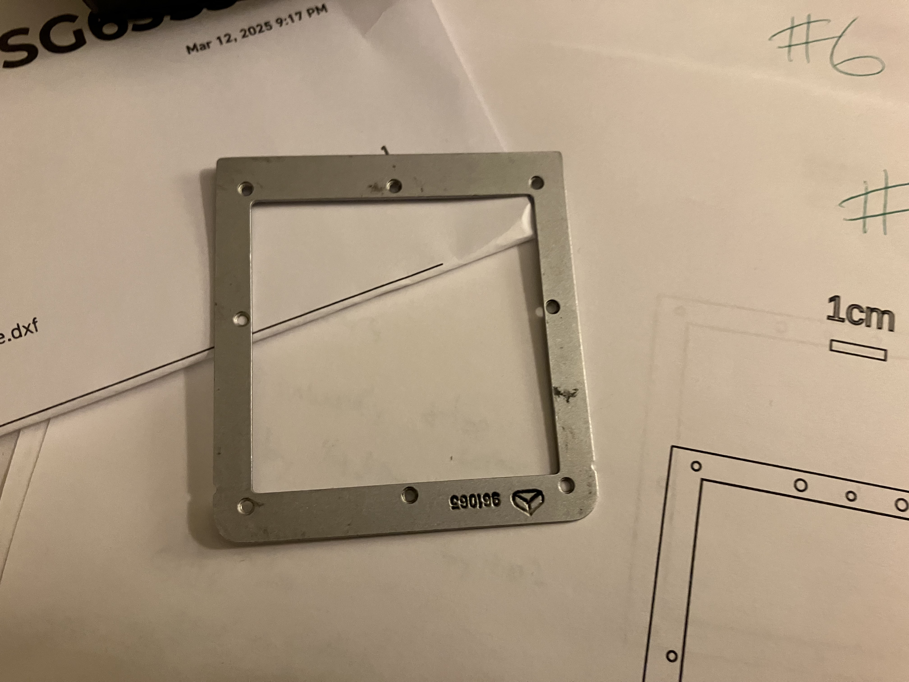
*the original factory plate*
   

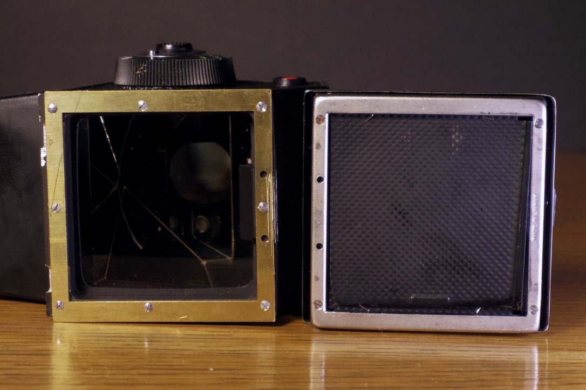
*new finder plate compared with the WLF.  Note the two front sides are facing each other.*
   

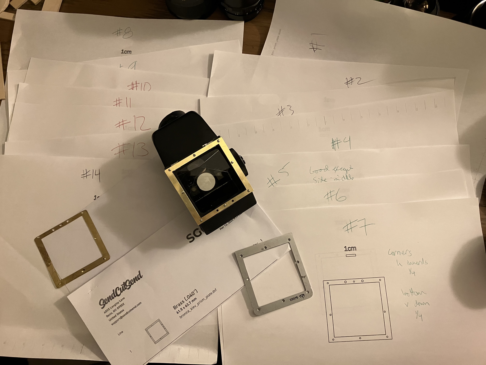
*The 14 printouts to measure/improve the accuracy of the cad file, one of the hand prototypes (left), the factory plate (right), and my plate installed*
   

  
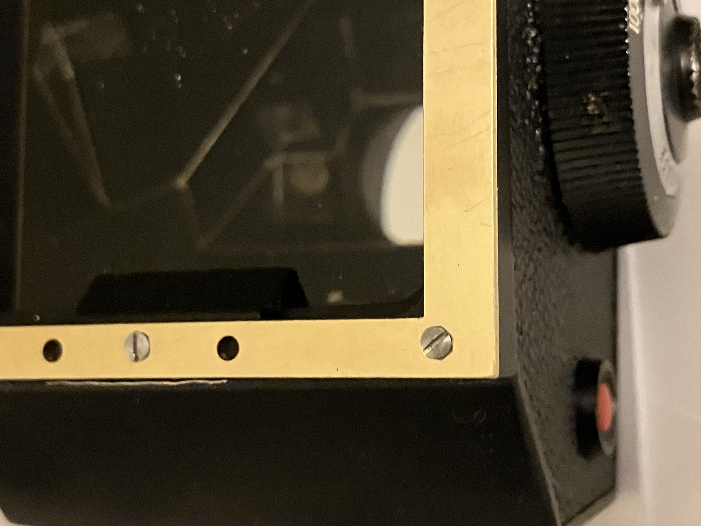
*countersink lets the screws sit nearly flush*
   

### problem #2 back side grooves

After removing the native Kiev plate, I measured where it sat over the prongs on the body, and marked the back side of the prism for where my notches needed to go.

I don't have fancy tools, so I just used a small hand file.  Because the notches need to be deep enough for the prongs to fit inside over the baseplate, I had to file an angle so as not to chew up too much of the inside of the finder.  Maybe there was a better way to do this, but it only took an hour or so of filing to make the grooves.

*The final grooves are ~2mm tall (NOT counting the baseplate).  Each is 6-7mm wide, and they are 33.5mm apart (16.75mm from the centerline).  You could probably get away with a narrower groove, but that's the width of the file I had.*

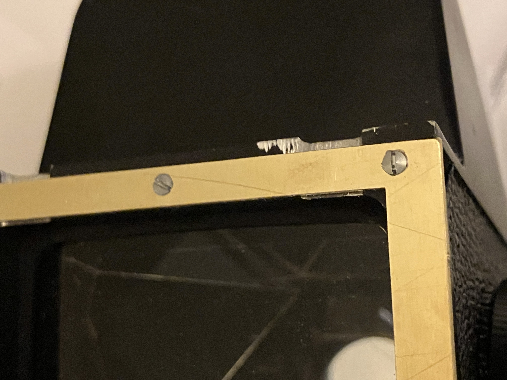
*Detail showing the notches*
   

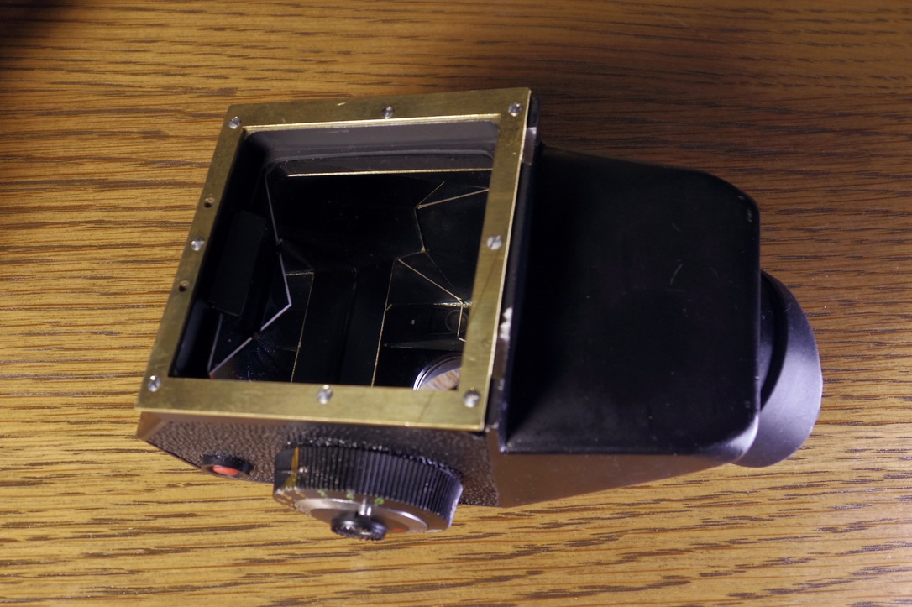
*My plate installed.  Note the notches*
   

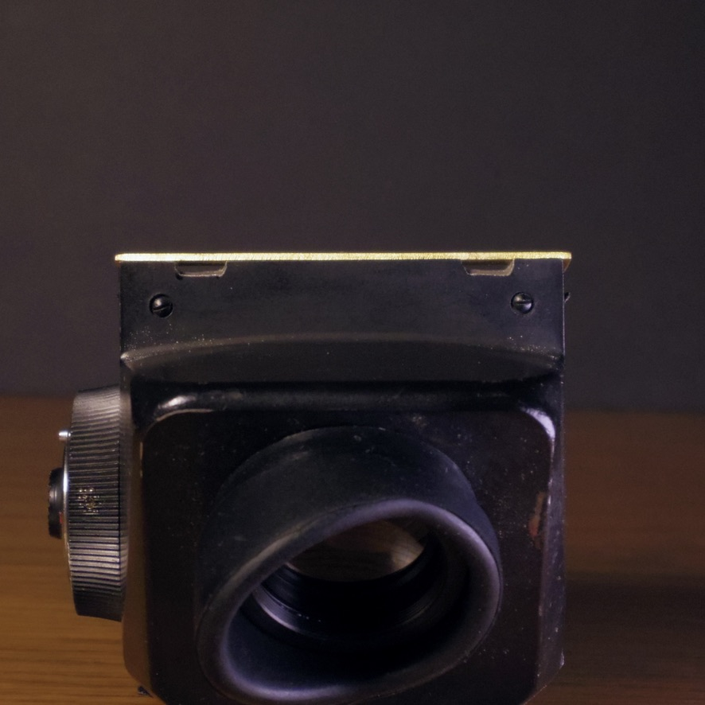
*back notches head on*
   

### problem #3 front latch notch

*The front notch needs to be about 14-15mm long from side to side (a little longer is fine), and should begin at 2.6mm above the baseplate (measured from the bottom of your baseplate, NOT from the base of the prism without a baseplate attached!  If you are long here, the front latch may not be able to lock; if short there may be rattling) and extend upwards ~2mm upwards from there.*

This is the part I did the worst on, by far.  I only had a flat file and, in retrospect, I should have ordered a triangular one to make the right shaped notch.  Instead, I just chewed the shit out of it with a dremel cutter wheel, despite my best efforts towards the correct angles.  Also, I definitely went through.

For that oopsie, and for the places where the notches go through on the back, I may need to investigate some light seal or patch, but to be determined whether that affects metering.  (Alternatively, if I were to do this again, I might explore adding a bendable tab to the baseplate that would fold up and over the front of the Kiev prism, providing at little more surface to latch onto, but that may require shifting the hole pattern backwards.... a v2 project.)

On the more immediate side, if you do go through, dust (especially ground metal dust from grinding) can get inside.  I'm still working out how best to avoid/fix this (ideas?), but I think going gently with a triangle file is probably the best bet.

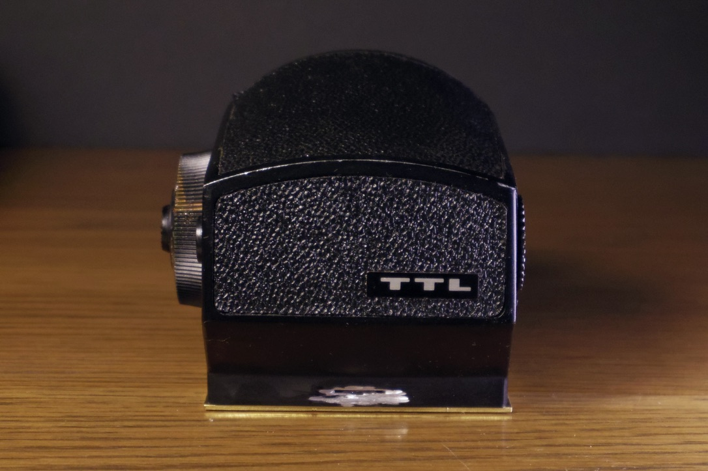
*I am ashamed of this butchery that is the groove for the front latch to catch on.*

### If you want to try this yourself...

You are welcome to either:

 - [download the DXF file](bronica_kiev_prism_plate%20-%202025-03-12%20scs%20proto%201.dxf), and laser cut it yourself or send it to a service like sendcutsend.  All you need to select is the material and thickness of the plate - that's it.
 - [download the PDF file](bronica_kiev_prism_plate.pdf), which has centering dots for the holes.  If you want to go the drill press and bandsaw route, these dots are for punching to center your drill bit.  If you don't have a drill press, I don't recommend doing it this way - I couldn't get drill holes accurate enough for the tiny screws by hand.

Suggestions for improving this procedure welcomed.

### Eyecups

My Kiev 88 did not come with a rubber eyecup.

First, I tried ordering [these generic ones](https://www.amazon.com/dp/B0CQXGXL1B?ref_=ppx_hzsearch_conn_dt_b_fed_asin_title_5) on Amazon.  They were a good fit but not great at blocking extraneous light.  I eventually broke down and just ordered [a new replacement eyecup directly from Arax](https://araxfoto.com/accessories/eye-cup/) for a better fit.

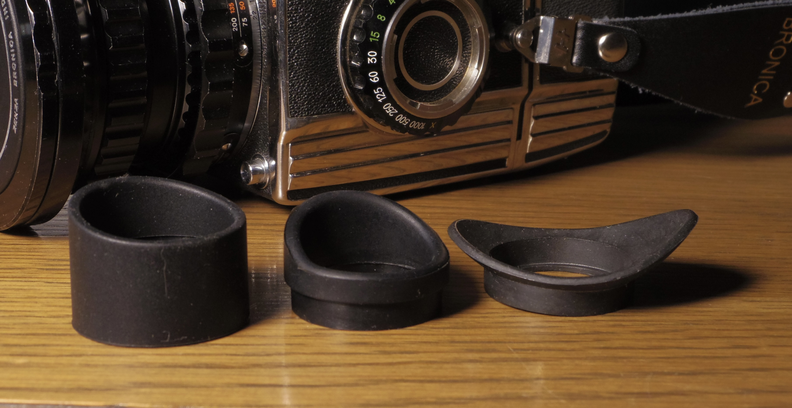
*A binocular eyepiece that was a poor fit, the generic amazon one, and the Arax one*

### Two other great resources on Kiev 88 finders:

https://kievaholic.com/meters.html  
https://www.mr-alvandi.com/downloads/camera-and-accessorys-manuals/kiev-88-TTL-meter-prisms.pdf   

### My other substantive Bronica S2-related reviews and how-tos:

[40mm Nikkor-D f4 review](https://www.reddit.com/r/AnalogCommunity/comments/1jkkd1u/the_little_known_alternative_to_the_hasselblad/)  
[500mm Komura f7 review](https://www.reddit.com/r/AnalogCommunity/comments/1h1fw50/bronica_s2a_telephoto_madness_the_komura_500mm_f7/)  
[Buster Brown 3A box camera lens adapted](https://www.reddit.com/r/AnalogCommunity/comments/1iykq9i/bronica_s2a_sporting_a_box_camera_lens_with_a/)  
[S2 bellows repair and S2->EC conversion](https://www.reddit.com/r/Bronica/comments/1jgc18j/bronica_s2_bellows_screw_replacements_and/)  
